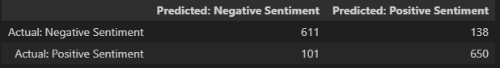
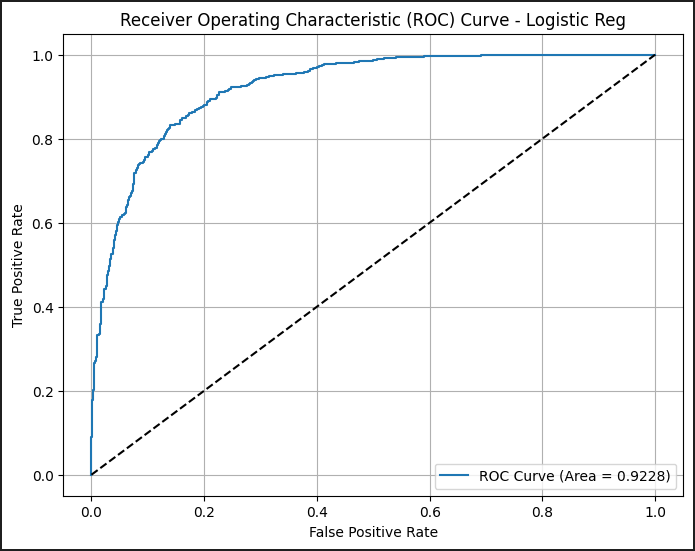
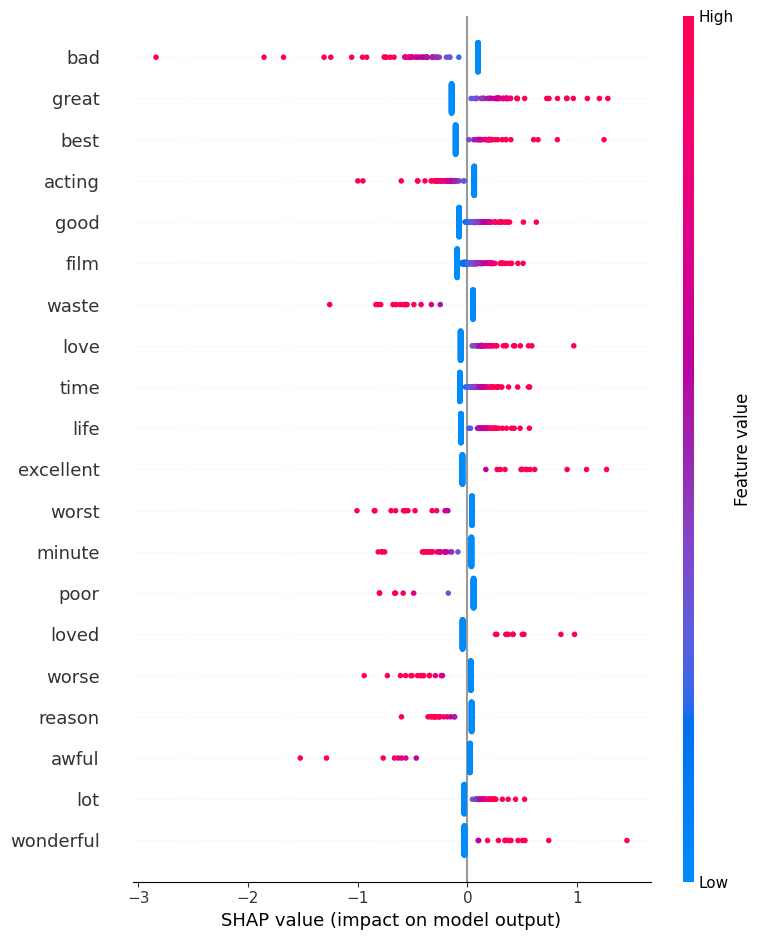
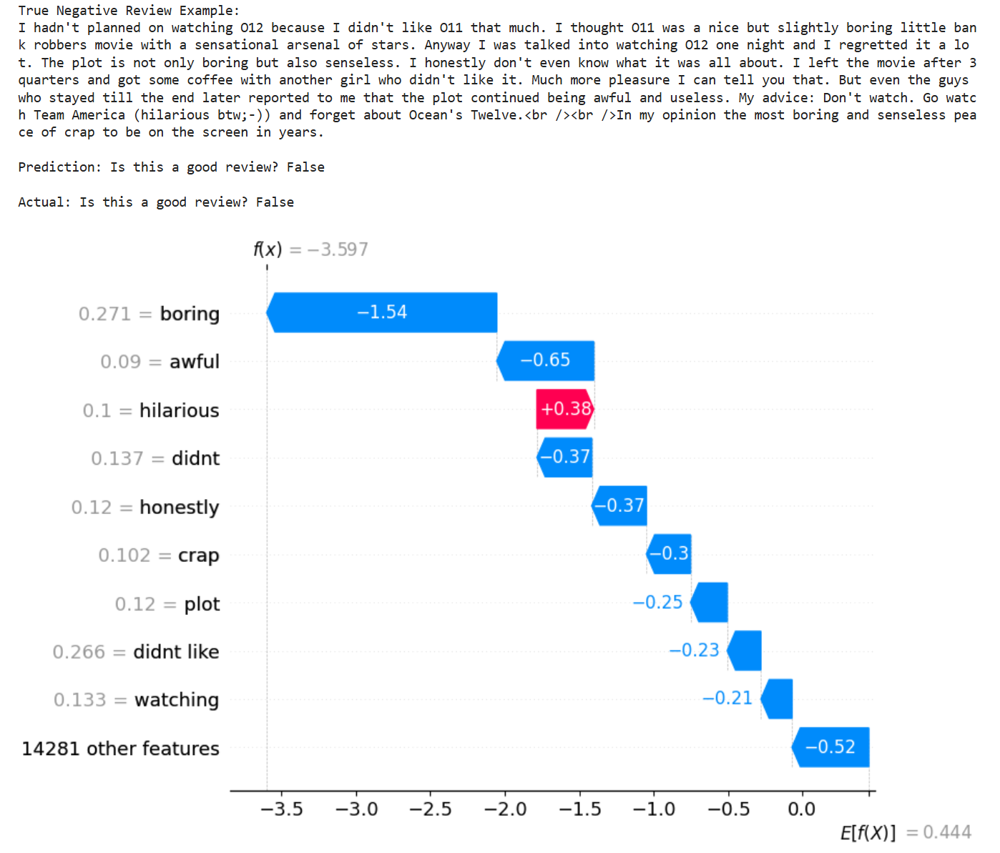

# 🎬 Movie Reviews Sentiment Analysis
A machine learning web app for analyzing movie review sentiment using natural language processing and explainable AI. 

Built with scikit-learn, NLTK, SHAP, and Streamlit, this project classifies movie reviews as positive or negative with detailed explanations of model predictions.

Originally created as the final project for the Cornell Tech ML Foundations Certification through Break Through Tech, expanded with NLP techniques, explainable AI features, and web app. More specifics can be found below.

**Future Features to Implement 💪**
- Utilizing fine tuning techniques with more advanced sentiment analysis models from HuggingFace like BERT
- Minimal Backend API using Flask to fetch new movie review data online for a particular film and store in SQLiteDB
- Applying pipeline on fetched movie reviews and displaying sentiment predictions and visualizations
---

## 🚀 Live Demo Site
- 👉 [Streamlit App](https://imdb-sentiment-analyzer-btt.streamlit.app/)
- 🧠 Model accuracy: 85% on test dataset
- 📊 AUC Score: 92%
- 📁 Dataset: [IMDB Movie Reviews Dataset](https://www.kaggle.com/datasets/lakshmi25npathi/imdb-dataset-of-50k-movie-reviews) - **only a sample of 6k reviews used for project**

## 🧠 Project Overview

- **Goal**: Classify movie reviews into sentiment categories:
    - Positive (good/favorable reviews)
    - Negative (bad/unfavorable reviews)

- **Model**: Logistic Regression with TF-IDF vectorization
- **Key Features:**
    - Text preprocessing pipeline using NLTK library & regex cleaning
    - TF-IDF feature extraction
    - Modeling using Logistic Regression with hyperparameter tuning using GridSearchCV, trained on sample of 4500 reviews
    - Test set model evaluation using various metrics like accuracy, confusion matrix & ROC-AUC curve (sklearn)
    - Explainable AI: SHAP explainability for model interpretations with summary & waterfall plots showing word contributions
    - Interactive web app showcasing predictive ability + model interpretability (Streamlit)

## 🛠️ Tech Stack
| Tool                            | Purpose                          |
|---------------------------------|----------------------------------|
| Python                          | Core programming language             
| scikit-learn                    | ML models + metrics
| NLTK                            | Natural Language Processing
| SHAP                            | Model explainability and interpretations
| Streamlit                       | Interactive web app 
| pandas / numpy                  | Data manipulation & analysis, vector operations
| matplotlib                      | Data visualization
| regex / string                  | Text preprocessing and cleaning

---

## 📊 Model Performance

- Accuracy: 85%
- AUC Score: 92%
- Precision: 82% (Positive)
- Recall: 87% (Positive)

---

## 🎯 Visualizations

*Figure: Confusion Matrix of LR Model Predictions*

*Figure: Receiver Operating Characteristics (ROC) Curve with AUC Score*

*Figure: SHAP summary plot created with SHAP values of first 200 reviews in test set. You can noticeably see that more negative words typically have higher, more negative feature-values whereas more positive words typically have higher, but more positive feature-values, which helps us understand which words are contributing the most to the model's sentiment predictions.*

*Figure: SHAP Waterfall plot for a single negative review prediction that the model got right (True Negative). Words present in the review like "boring" and "awful" contribute heavily to the model's negative total SHAP value & negative prediction.*

---

## 📍 To run locally:

Clone the repository:

`git clone https://github.com/your-username/movie-review-sentiment-analyzer.git`

`cd movie-review-sentiment-analyzer`

Create and activate virtual environment (I used Python 3.11.9 for my venv):

`python -m venv env-name # env-name represents the name you give to your venv`

`source venv/bin/activate  # On Windows: venv\Scripts\activate`

Install dependencies:

`pip install -r requirements.txt`

Run the Streamlit app:

`streamlit run app.py`

Open your browser and go to http://localhost:8501

## 📁 Project Structure

| File/Folder | Description |
|-------------|-------------|
| `DefineAndSolveMLProblem.ipynb` | Complete ML pipeline with analysis & documentation |
| `demo.py` | Interactive Streamlit web application |
| `preprocessing.py` | Text preprocessing and cleaning functions |
| `log_reg_model.sav` | Trained logistic regression model |
| `tfidf_vectorizer.sav` | Fitted TF-IDF vectorization object |
| `shap_explainer.sav` | SHAP explainer for model interpretability |
| `requirements.txt` | Python package dependencies |
| `visualizations/` | Performance charts and analysis plots |
| `README.md` | Project documentation and setup guide |

## 🔍 Acknowledgements:

- IMDB Movie Reviews Dataset contributors
- Cornell Tech and Break Through Tech for the ML Foundations Certification program
- SHAP library developers for explainable AI tools
- Streamlit community for deployment tutorials

